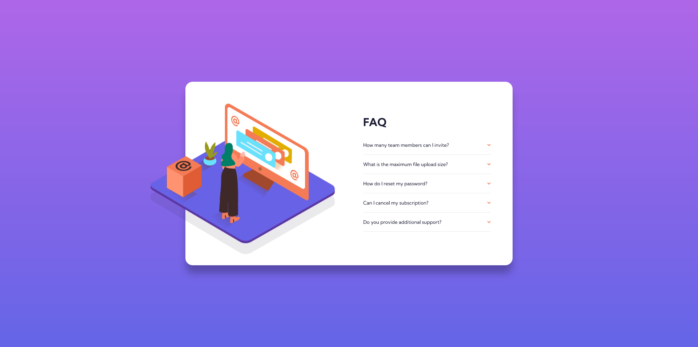

# Frontend Mentor - FAQ accordion card solution

This is a solution to the [FAQ accordion card challenge on Frontend Mentor](https://www.frontendmentor.io/challenges/faq-accordion-card-XlyjD0Oam). Frontend Mentor challenges help you improve your coding skills by building realistic projects. 

## Table of contents

- [Overview](#overview)
  - [The challenge](#the-challenge)
  - [Screenshot](#screenshot)
  - [Links](#links)
- [My process](#my-process)
  - [Built with](#built-with)
  - [What I learned](#what-i-learned)
  - [Continued development](#continued-development)
  - [Useful resources](#useful-resources)
- [Author](#author)

## Overview

### The challenge

Users should be able to:

- View the optimal layout for the component depending on their device's screen size
- See hover states for all interactive elements on the page
- Hide/Show the answer to a question when the question is clicked

### Screenshot



### Links

- Solution URL: [here](https://your-solution-url.com)
- Live Site URL: [here](https://your-live-site-url.com)

## My process

### Built with

- Semantic HTML5 markup
- CSS custom properties
- CSS Animations
- Flexbox
- Mobile-first workflow
- JavaScript

### What I learned

After a lot of thinking, i've found a way of applying a event listener to all the titles to make it open each correspondent description. About the HTML and CSS, it was more of the same, except that now i've explored more my transitions, hover effects and animations.

Liked my li building choices
```html
<li>
          <button>How many team members can I invite?<svg width="10" height="7" xmlns="http://www.w3.org/2000/svg">
              <path d="M1 .799l4 4 4-4" stroke="#F47B56" stroke-width="2" fill="none" fill-rule="evenodd" />
            </svg></button>
          <p>You can invite up to 2 additional users on the Free plan. There is no limit on team members for the Premium
            plan.</p>
        </li>
```

And the onload animation
```css
@keyframes fromCenter {
    from {
        opacity: 0;
        transform: scale(0);
    }

    to {
        opacity: 1;
        transform: scale(1)
    }
}
```

And finaly the for loop that take a lot of thinking despite its simplicity, but the leasson was settled.

```js
for (let i = 0; i < btns.length; i++) {
    btns[i].addEventListener('click', () => {
        targets[i].classList.toggle('activeP')
        arrows[i].classList.toggle('downArrow')
    })
}
```

### Continued development

Looking foward to develop a way of applying the the style on the focused tittles on a h2, not on a button, that was my original choice. and also a more smooth way of making the paragraph appear.

### Useful resources

- [Shadow on a SVG](https://css-tricks.com/adding-shadows-to-svg-icons-with-css-and-svg-filters/) - This helped me doing the SVG shadow, had no clue of how to do that.

## Author

- Frontend Mentor - [@jAllanOli](https://www.frontendmentor.io/profile/jAllanOli)
- gitHub - [@jAllanOli](https://github.com/jAllanOli)
